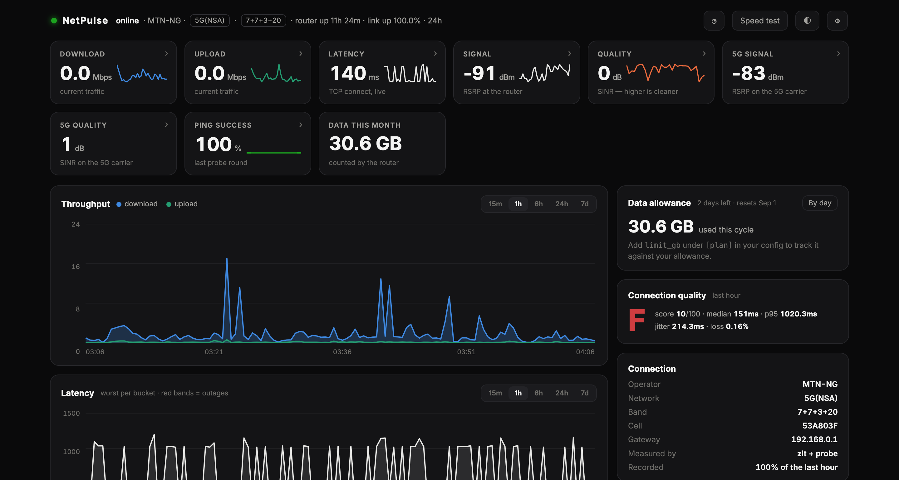
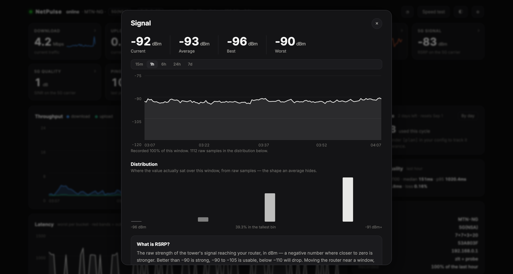
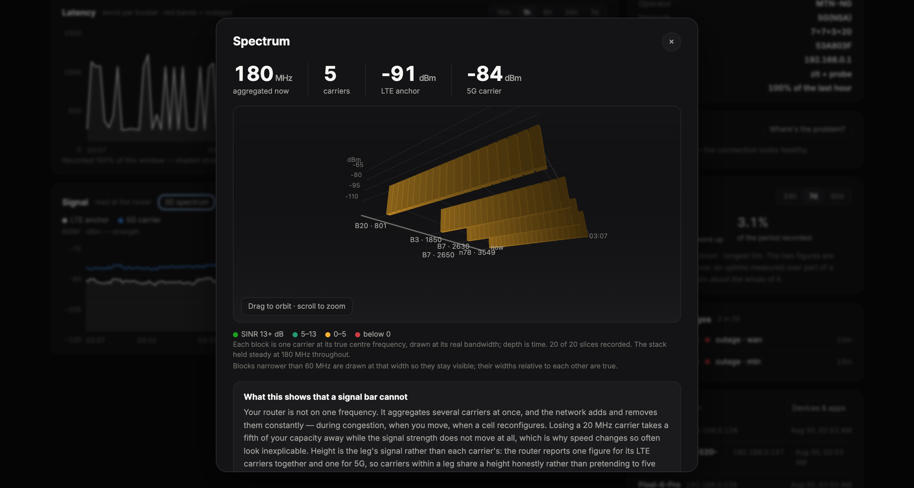
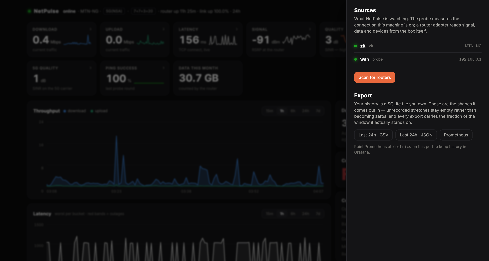

<div align="center">

# NetPulse

**Local-first monitoring for any home connection — not just one brand of dish.**

[](tests/)
[](pyproject.toml)
[](pyproject.toml)
[](LICENSE)

</div>



NetPulse watches your internet connection, records what it sees, and tells you the
truth about it — including when it does not know. It reads your router directly over
the LAN, so it keeps working during an outage, which is exactly when you want to see
what happened.

**No account, no cloud, no telemetry.** Everything it records is a SQLite file on your
own machine. The dashboard binds to `127.0.0.1`. Nothing is ever sent anywhere, with
one exception you configure yourself: alert channels, which carry the alert and nothing
else.

```bash
pip install netpulse-monitor
netpulse discover     # finds your router and writes the config
netpulse run          # http://127.0.0.1:8787
```

That is the whole install. **Zero runtime dependencies** — standard library only, so it
runs on a Raspberry Pi as readily as a laptop, and there is nothing to break when a
package you have never heard of publishes a bad version.

---

## Why this exists

Most connection monitors are built for one vendor's hardware. [Dishylink][dishy] is an
excellent one for Starlink, and much of the honesty engineering here is learned from it.
But most of the world is not on Starlink. In Nigeria — where this was built and tested —
the common boxes are ZLT, Huawei and ZTE, and none of them had anything like this.

NetPulse is built on one contract: an adapter reads a source and returns a `Reading`.
Storage, outage detection, charts, diagnosis and the dashboard are written against that
and nothing else. **A new router is one file.**

[dishy]: https://github.com/DaveyHert/Dishylink

---

## Routers it reads

| Adapter | Hardware | API | Login needed |
|---|---|---|---|
| `zlt` | ZLT / Tozed — MTN Nigeria's own-brand 5G (X17U, K10, S20, T30…) | `POST /cgi-bin/http.cgi` | only for devices |
| `huawei` | Huawei CPE — MTN, Glo, 9mobile, Vodacom | XML at `/api/*` | only for SMS |
| `zte` | ZTE MC-series — Airtel, MTN HyNetFlex (a rebadged MF286) | `/goform/` or `/reqproc/` | no |
| `starlink` | every dish — Gen1 round through Gen3, Flat HP, Mini | gRPC-Web on `:9201` | no |
| `netgear` | Nighthawk M1/M2/M5/M6, AirCard, LB1120/LB2120, LM1200 | `model.json` | no |
| `fastmile` | Nokia FastMile 4G/5G — MTN South Africa, Safaricom and many more | `fastmile_radio_status_web_app.cgi` | no |
| `snmp` | MikroTik RouterOS, Teltonika RutOS | SNMPv2c on 161 | community string |
| `probe` | **anything at all** | ICMP/TCP/DNS from this machine | n/a |

FastMile is the one router here that publishes every aggregated carrier separately
rather than flattening them into one string, so its spectrum view is per-carrier
without any unpicking. It publishes no connection state, and NetPulse does not invent
one: the radio is reported, and whether traffic reaches the internet is left to the
`probe` source, which measures it.

Discovery also **names** routers it cannot yet read — GL.iNet, OpenWrt, MikroTik,
TP-Link, Tenda, Cudy, Sagemcom, Technicolor — so an unsupported box
is a message about a missing adapter rather than a silent "no router found".

Yours missing? `netpulse probe-router http://<address>` prints what its firmware
actually answers, with anything secret elided, including the script bundles its own web
UI loads — those bundles are the specification. The ZLT adapter was written from exactly
that output in about an hour. See **[docs/adding-a-router.md](docs/adding-a-router.md)**.

---

## What it shows

### The dashboard

Live tiles for download, upload, latency, signal, quality, 5G carrier, ping success and
data used — each with a sparkline, each opening a detail view with current/average/best/
worst figures, its own time range, the full series, a **distribution histogram** built
from raw samples, and a plain-English explainer of what the number means and what moves
it.



Below: throughput and latency charts with per-panel ranges, signal charts showing both
legs of a 5G non-standalone connection, and a right-hand column of instruments —
connection quality graded A–F, the data allowance, a rule-based diagnosis, uptime, and
the events log.

Responsive down to 390px, because a network monitor is most needed on the device in your
hand while the connection is misbehaving.

### 3D spectrum

Your router is not on one frequency. It aggregates several carriers at once, and the
network adds and removes them all day — during congestion, when you move, when a cell
reconfigures. **Losing a 20 MHz carrier takes a fifth of your capacity away while the
signal strength does not move at all**, which is why speed changes so often look
inexplicable.

NetPulse converts each carrier's channel number to its true frequency with 3GPP's own
arithmetic (TS 36.101 §5.7.3, TS 38.104 §5.4.2.1) and draws the stack in three
dimensions: real positions, real bandwidths, coloured by SINR, receding through time.
A test link shows five carriers — bands 20, 3, 7, 7 and n78 at 801, 1850, 2630, 2650 and
3549 MHz — totalling 180 MHz.



Rendered in about a hundred lines of canvas. No WebGL, no library.

### Data usage, three ways

- **By day** — derived from the router's own odometer, so a recorded day is complete,
  resets included. A day NetPulse was not running draws as a hatched placeholder, never
  a short bar: a short bar reads as a quiet day, which is the opposite of the truth.
- **By application** — on the machine NetPulse runs on. A router sees IP flows, not
  programs; attributing bytes to an app from the router's side would mean inspecting
  traffic, which this does not do.
- **By device** — where a router publishes per-client counters. Many do not, and the
  view says so rather than showing a figure that is always zero.

They are kept apart and will not sum to each other, because they measure three different
things. Three honest measurements beat one total that quietly apportions what nobody
counted.

### Devices and control

The connected-device list with names, leases and private-MAC detection, and — with a
router password — **block and unblock a device** from the app, behind a confirmation.

Blocking is the only write NetPulse ever makes. It is a separate capability from the
read contract, so the collector cannot reach it by accident and the dashboard has to ask
whether it exists before offering it.

### Where's the problem?

```bash
netpulse path
```

Traces the path and attributes the delay. A private address past your router is inside
your carrier's network and is named as theirs. A public one might be their transit, a
peering link, or the far end — and it says so rather than guessing, because telling
those apart needs a lookup of who owns the address, which would mean sending your path
to a third party.

A hop reporting 400 ms while everything past it reports 40 ms found a busy control
plane, not a problem — only a rise that persists to the end is counted.

### Alerts you write yourself

```toml
[[alert]]
metric = "signal.rsrp_dbm"
below = -105
for_minutes = 5
message = "Signal weak enough to drop the connection"

[[channel]]
kind = "ntfy"           # webhook · slack · discord · ntfy · home_assistant
url = "https://ntfy.sh/my-private-topic"
```

A duration is measured in time, not polls, so "for 5 minutes" means five minutes at any
poll rate — and cannot be satisfied by two readings either side of a gap. **Missing data
never breaches a rule**: absence is not a weak signal, and a router that stops answering
should not trip every threshold at once.

Alerts reach a desktop notification and any channel you configure, because an OS toast
is useless when the machine watching your link is a Pi in a cupboard.

### Getting your data out

| What | Where |
|---|---|
| Prometheus / Grafana | `GET /metrics` |
| CSV for a spreadsheet | `GET /api/export?source=…&format=csv` |
| JSON for a script | `GET /api/export?source=…&format=json` |
| Uptime report | `GET /api/uptime?source=…&days=30` |

Gaps stay empty rather than becoming zeros. The uptime report gives uptime **and**
coverage separately, because 99.9% uptime over 3% coverage is not a 99.9% month.



---

## The rules it holds itself to

These are not aspirations; they are what the tests enforce.

**A gap in recording is a gap in every chart and total.** A bucket nobody sampled
returns `None`, not zero and not the previous value. Charts break the line and shade the
gap. Every ranged answer carries a coverage fraction, and the UI prints it. *A figure
that quietly spans a gap is worse than no figure, because it looks like knowledge.*

**Absent is not zero.** An unpopulated field is `None`. Recording an empty signal
reading as `0.0` would draw a flat line where there is no measurement.

**Never publish a number you had to invent.** A first counter reading is a position, not
a rate. A reboot or a 32-bit wrap makes a delta meaningless, so the adapter re-baselines
and emits nothing — a wrapped counter published as throughput is a multi-gigabyte burst
that never happened, and the charts keep it forever.

**Raw for extremes, buckets for shape.** Best, worst and p95 come from raw samples.
Reading them off a max-bucketed series gives the *best bad minute*, which is a different
and wrong number.

**Under-claiming is the cheaper mistake.** Discovery reports a router it can name but not
read. A matcher that is unsure returns "not this family". Uptime excludes unrecorded time
rather than assuming it was up.

**Poll gently.** CPE routers are fragile embedded boxes — Dishylink's watchdog-rebooted
from one extra poll endpoint. One sweep per cycle; heavy endpoints ride a counter; every
call is bounded, because an unbounded call does not merely stall, *it invents the outage
it then writes down*.

---

## Configuration

`~/.netpulse/netpulse.toml`, written by `netpulse discover` and yours to edit. Created
`0600`, and every start warns if a file holding a password is readable by other accounts.

```toml
interval_s = 5

[[source]]
name = "mtn"
kind = "zlt"                 # zlt · huawei · zte · starlink · snmp · probe
url = "http://192.168.0.1"
username = "admin"           # optional: unlocks the device list and blocking
password = ""                # used only to sign in to this router; never leaves the machine

[[source]]
name = "wan"
kind = "probe"

[plan]
limit_gb = 100
reset_day = 15               # carriers rarely renew on the 1st
```

---

## Commands

```
netpulse run [--demo] [--port 8787]   record and serve the dashboard
netpulse discover                     find your router, write the config
netpulse status                       latest reading per source
netpulse events                       outages and degradations
netpulse diagnose                     rule-based diagnosis with evidence
netpulse path [target]                trace the path, say where the delay starts
netpulse probe-router <url>           show what a router answers, for new adapters
netpulse speedtest                    on-demand speed test
```

---

## Architecture

A strict DAG, and **[tests/test_architecture.py](tests/test_architecture.py) fails the
build when a layer reaches upward** — an architecture that lives only in a document is a
suggestion.

```
                         cli
                          │
              web/  api → server → the page
                          │
                      monitor.py                ← the collector
                          │
                       config.py
                          │
            ┌─────────────┴─────────────┐
        alerting/                   analysis/
  alerts · channels · notify   quality · insights · allowance
            │                  path · export · speedtest
            └─────────────┬─────────────┘
                      sources/                  ← one file per router family
            adapters · vendors · discover · snmp
                          │
                       core/
               storage → clock · model · radio
```

`api.py` holds every question and knows nothing about sockets, so the whole API is tested
by calling it. An adapter may never reach the store or the collector — that edge is what
keeps "a new router is one file" true.

The UI is a web page on purpose: Electron costs 200 MB, a signing certificate and
per-platform builds, and still ships no Linux build. A loopback server serves your
laptop, your phone on the same wifi, and a headless Pi over a forwarded port from one
codebase. It is authored as ten files and concatenated into **one self-contained
response** at startup — no CDN, no build step, nothing fetched — because the page has to
render during the outage it is explaining.

Full detail in **[docs/architecture.md](docs/architecture.md)**.

---

## Development

```bash
uv sync
uv run pytest -q            # 263 tests, none touching the network
uv run ruff check .
uv run mypy netpulse/       # strict
```

Every adapter takes an injectable `fetch`, and every module that needs "now" takes a
`Clock`, so the suite never sleeps and never opens a socket. Test fixtures are payloads
captured verbatim from real hardware, so they fail when an adapter stops matching real
firmware rather than when it stops matching someone's idea of one.

`tests/test_web.py` runs `node --check` over the dashboard — **joined as well as
separately**, because a `const` declared twice across two files only fails when they
meet, and one syntax error turns the page blank while every Python test still passes.

---

## Honest limitations

- **Per-device data usage depends on your router.** Many report a per-client byte
  counter and leave it at zero — verified under live traffic, and their own web UI never
  displays it either. NetPulse measures the machine it runs on and says plainly why the
  other rows are empty.
- **Applications are this machine only.** macOS via `nettop`, Linux via `ss`. A router
  cannot see which programs run on anything.
- **Daily boundaries are UTC**, which may not match your midnight. Stated where the
  figures are shown rather than corrected by guessing a timezone.
- **The vendor APIs are undocumented and unofficial.** They change. `probe-router` exists
  so a break is diagnosable rather than mysterious.

---

## Licence

MIT. See [LICENSE](LICENSE).

NetPulse is an independent project with no affiliation to MTN, Airtel, Glo, ZTE, Huawei,
ZLT/Tozed, SpaceX or Starlink. All trademarks belong to their owners.
